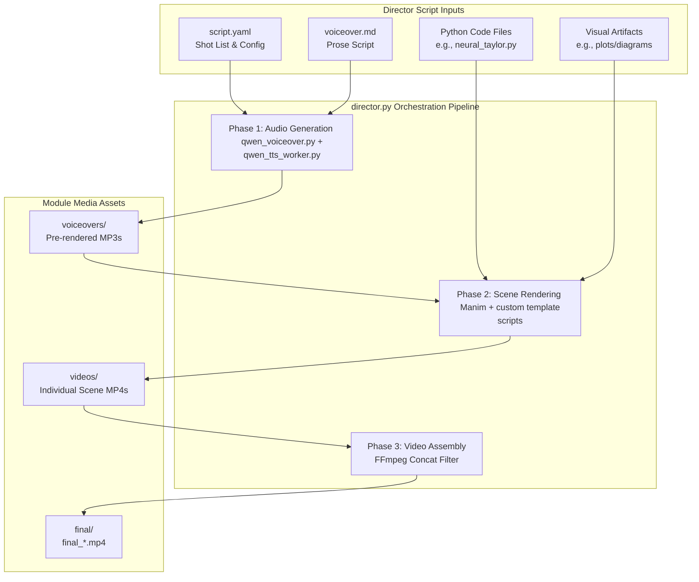

# 🪐 SciML Video Generation Pipeline: Architecture & User Guide

Welcome to the **SciML Video Generation Pipeline**. This guide explains the system architecture, directory structures, script formats, execution steps, and best practices for creating high-quality, professional educational videos for Scientific Machine Learning (SciML) in Quantitative Finance.

---

## 🏗️ 1. System Architecture

The video generation pipeline is a semi-automated engine that accepts a structured "Shot List" (YAML) and a companion "Prose Script" (Markdown), synthesizes speech using custom local Text-to-Speech (TTS), renders visual scenes using **Manim (Community Edition)**, and stitches them into a final production-grade video file using **FFmpeg**.



### Core Architecture Components
1. **`director.py` (The Orchestrator)**: The command-line entry point. It parses your configuration, manages environment variables, sets dependencies (like SoX paths on Windows), and triggers each step sequentially or selectively.
2. **`qwen_voiceover.py` & `qwen_tts_worker.py` (The Voice Synthesizer)**: Interfaces with the custom `Qwen3-TTS` local voice synthesis model. To prevent GPU/CUDA conflicts and Out-Of-Memory (OOM) errors during heavy Manim rendering, TTS runs in isolated subprocesses using either CUDA (if available) or highly stable CPU fallback.
3. **Scene Templates (`pipeline/scene_templates/`)**: Pre-built Manim scene skeletons that load JSON configurations at runtime to render complex visualizations (LaTeX equations, syntax-highlighted code with line highlights, split screens, static plots) dynamically without writing custom Python code for every slide.
4. **FFmpeg Concat**: Merges the separate high-definition MP4 scenes together seamlessly without re-encoding, preserving quality and keeping rendering fast.

---

## 📂 2. Recommended Directory Structure

For clean project organization, each module (e.g., `01_neural_taylor_series`, `02_physics_of_no_arbitrage`) maintains its own self-contained folder structure.

```text
d:\SCIML_QF\<module_folder>\          # e.g., 01_neural_taylor_series/
│
├── 📂 director_scripts/              # 👈 The input scripts provided by the Director
│   ├── script.yaml                   # Shot-by-shot configuration file
│   └── voiceover.md                  # Human-readable voiceover prose
│
├── 📂 code/                          # Source code files shown in code walkthroughs
│   └── neural_taylor.py
│
├── 📂 manim/                          # Custom Manim script files (if using 'animation' type)
│   └── custom_scenes.py
│
├── 📂 media/                         # 🛠️ Generated automatically by the pipeline
│   ├── 📂 voiceovers/                # Synthesized audio files (.mp3)
│   ├── 📂 videos/                    # Individual rendered scene videos (.mp4)
│   ├── 📂 final/                     # Final stitched production video
│   └── manifest.txt                  # Temporary compilation manifest for FFmpeg
│
└── requirements.txt                  # Python dependencies specific to this module
```

---

## 📝 3. Script Formats & Templates

### A. The Prose Script (`voiceover.md`)
This document is a human-readable script used by writers and reviewers. It defines the pacing, emotional instructions, and exact words spoken for each scene.

*   **Rule 1**: Every scene must start with a heading identifying the scene ID: `**[SCENE scene_id: brief description]**`.
*   **Rule 2**: Scene IDs must exactly match the IDs used in the companion `script.yaml` file.
*   **Rule 3**: Include explicit emotion/pacing directives: `**(Pacing: instructional, professional, measured pace)**`.
*   **Rule 4**: Wrap the spoken script in square brackets: `[Spoken Text: "Your content here..."]`.

*Refer to the standard template:* [voiceover_md_template.md](file:///d:/SCIML_QF/templates/voiceover_md_template.md)

---

### B. The Shot List (`script.yaml`)
This is the machine-readable config parsed by `director.py`. It maps each voiceover block to a specific visualization type, equations, code line ranges, or animations.

*Refer to the standard template:* [script_yaml_template.yaml](file:///d:/SCIML_QF/templates/script_yaml_template.yaml)

```yaml
module: "01_neural_taylor_series"
title: "The Neural Taylor Series"
resolution: "1920x1080"
fps: 30
transition_style: "crossfade"      # Transition style between scenes (cut, crossfade)
transition_duration: 0.5           # Transition duration in seconds

voice:
  speaker: "Ryan"
  default_instruct: "Professional, educational, measured pace."

scenes:
  - id: "scene_1_intro"
    type: animation
    voiceover: >
      Welcome to Module 1. Today we are exploring the Universal Approximation Theorem.
    instruct: "Enthusiastic and engaging."
    manim_class: "NeuralTaylorIntro"
    source: "manim/custom_scenes.py"
```

---

## 🎥 4. Supported Scene Types

The pipeline has 5 built-in scene templates, allowing you to create rich educational visuals without writing raw Manim code from scratch.

### 1. Custom Animation (`type: animation`)
*   **Purpose**: Renders custom-designed Manim scenes written by developers.
*   **YAML Config parameters**:
    *   `source`: Filepath to the `.py` script containing the scene.
    *   `manim_class`: The class name of the scene inside the source file.
*   **Example**:
    ```yaml
    - id: "surface_warp_3d"
      type: animation
      voiceover: "Let's watch how the neural network warps this 2D payoff surface."
      source: "manim/custom_scenes.py"
      manim_class: "OptionSurfaceWarp"
    ```

### 2. Equation Display (`type: equation`)
*   **Purpose**: Displays beautifully rendered LaTeX formulas with automatic text alignment.
*   **YAML Config parameters**:
    *   `equations`: A list containing `latex` (raw LaTeX string) and optional `highlight_terms`.
*   **Example**:
    ```yaml
    - id: "black_scholes_pde"
      type: equation
      voiceover: "This is the Black-Scholes partial differential equation."
      equations:
        - latex: "\\frac{\\partial V}{\\partial t} + \\frac{1}{2}\\sigma^2 S^2 \\frac{\\partial^2 V}{\\partial S^2} + rS \\frac{\\partial V}{\\partial S} - rV = 0"
          highlight_terms: [1]
    ```

### 3. Code Walkthrough (`type: code`)
*   **Purpose**: Renders syntax-highlighted code panels and dynamically highlights specific code lines in sync with the audio.
*   **YAML Config parameters**:
    *   `code_file`: Path to the script relative to the module root.
    *   `code_range`: `[start_line, end_line]` (1-indexed) subset of the code to show on screen.
    *   `highlights`: A list of `lines` to surround with boxes and `pause` duration.
*   **Example**:
    ```yaml
    - id: "neural_network_loss"
      type: code
      voiceover: "Here we define our PDE residual loss function."
      code_file: "code/neural_taylor.py"
      code_range: [15, 30]
      highlights:
        - lines: [18, 22]
          pause: 2.5
        - lines: [25, 29]
          pause: 1.5
    ```

### 4. Split-Screen (`type: split`)
*   **Purpose**: Shows code on one side and an animation or visualization on the other.
*   **YAML Config parameters**:
    *   `layout`: e.g., `code_left_anim_right` or `anim_left_code_right`.
    *   `left`/`right` sub-blocks defining the content blocks.
*   **Example**:
    ```yaml
    - id: "split_train_loop"
      type: split
      voiceover: "On the left, you see the optimizer step, while the plot on the right converges."
      layout: "code_left_anim_right"
      left:
        content: code
        code_file: "code/neural_taylor.py"
        code_range: [40, 52]
      right:
        content: animation
        source: "manim/custom_scenes.py"
        manim_class: "LossCurveConvergence"
    ```

### 5. Visual Artifact Embed (`type: artifact`)
*   **Purpose**: Shows static figures, plots, diagrams, or charts directly.
*   **YAML Config parameters**:
    *   `artifact_path`: Path to the image file relative to the module folder.
    *   `animation`: Transition effect (e.g. `fade_in`, `wipe`).
*   **Example**:
    ```yaml
    - id: "error_plot_display"
      type: artifact
      voiceover: "The validation plot demonstrates that absolute error drops below 10 to the minus 4."
      artifact_path: "media/error_plot.png"
      animation: "fade_in"
    ```

---

## 🚀 5. How to Run the Pipeline

### Prerequisites
1.  **Python 3.9+** virtual environment activated (e.g., `env\Scripts\activate` on Windows).
2.  **Manim** installed along with its system requirements (LaTeX/MiKTeX, FFmpeg, SoX).
3.  **SoX (Sound eXchange)**: Highly recommended for Windows. The script automatically appends `C:\Program Files (x86)\sox-14-4-2` to your system path.

### Execution Command
The general command structure is:
```powershell
env\python.exe pipeline\director.py <module_directory> [flags]
```

### Supported Flags
*   `module_dir` (Positional, Required): Path to the module folder, e.g. `01_neural_taylor_series`.
*   `--phase` (Optional, Choices: `audio`, `render`, `video`, `stitch`, `all`):
    *   `audio`: Pre-generate the voiceovers using local Qwen3-TTS.
    *   `render`: Render individual scene videos using Manim (with actual voiceovers).
    *   `video`: Render individual scene videos with dummy/silent audio (no TTS generation required, fast visual preview).
    *   `stitch`: Compile all generated scene clips into a single final video.
    *   `all` (Default): Executes all three phases (audio, render, stitch) sequentially.
*   `--quality` (Optional, Choices: `l`, `m`, `h`, `k`):
    *   `l` (Low preview: 480p, 15fps) - **Recommended for rapid iteration and testing.**
    *   `m` (Medium: 720p, 30fps).
    *   `h` (High production: 1080p, 60fps) - **Recommended for final exports.**
    *   `k` (Ultra HD: 2160p, 60fps).
*   `--scene` (Optional): Only process this specific scene ID (e.g. `scene_1_intro`). This is highly useful for iterating on a single scene.

### Execution Examples
**1. Low-Quality Preview Run (Highly Recommended First Step)**
Run the entire pipeline at a low-quality setting to inspect timings, text formatting, and highlights:
```powershell
env\python.exe pipeline\director.py 01_neural_taylor_series --phase all --quality l
```

**2. Video Visual Preview Only (No TTS Audio Generation)**
Render visuals using silent dummy audio to inspect animations quickly without triggering speech synthesis:
```powershell
env\python.exe pipeline\director.py 01_neural_taylor_series --phase video --quality l
```

**3. Voiceover Only**
If you want to review or tweak synthesized speech audio first:
```powershell
env\python.exe pipeline\director.py 01_neural_taylor_series --phase audio
```

**4. Render and Stitch Preview**
If you've already generated audio and only modified code files or templates:
```powershell
env\python.exe pipeline\director.py 01_neural_taylor_series --phase render --quality l
env\python.exe pipeline\director.py 01_neural_taylor_series --phase stitch --quality l
```

**5. Production Export**
Compile the absolute final video in full HD:
```powershell
env\python.exe pipeline\director.py 01_neural_taylor_series --phase all --quality h
```

---

## 💡 6. Best Practices & Troubleshooting

*   **Use Video Phase for Fast Visual Iteration**: Use `--phase video` during initial visual design stages. It runs Manim using silent dummy audio, skipping TTS, which saves time and avoids generating redundant audio files.
*   **Use Low Quality `l` for Drafts**: Don't waste compute rendering 1080p60 on early drafts. Check your layout, subtitle text, and line numbers at 480p15 first.
*   **Use Precise Highlights**: When displaying code using the `code` template, ensure `code_range` encompasses all the lines you intend to show, and keep `highlights` ranges strictly bounded relative to the whole file.
*   **Audio Hashing and Caching**: The pipeline hashes the scene script text, speaker, and instructions to check if audio needs regeneration. Text is normalized to ignore whitespace and newline variations. If you change only formatting or whitespace in your YAML file, the cached audio will be reused automatically.
*   **Organized Clips Directory**: Individual scene videos are copied and renamed to `<module_dir>/media/scene_clips/` before stitching. This keeps individual raw Manim renders separate from your modular scene-specific cuts.
*   **TTS Fallbacks**: If you run into memory pressure issues on local dev rigs, the TTS engine automatically falls back to CPU generation. It takes a little longer but guarantees rendering stability.
*   **Pre-generating Audio**: The voiceover audio is stored in `<module_dir>/media/voiceovers/`. If you alter script text, delete or overwrite the corresponding audio file or rerun `--phase audio` so the system regenerates it.
*   **Windows SoX Errors**: If you encounter errors about `sox` not being recognized, verify that SoX is installed at `C:\Program Files (x86)\sox-14-4-2` or update the path on line 121 of `pipeline/director.py`.

---

*This guide was generated directly from the design guidelines and runtime characteristics established in the SCIML QF workspace.*
